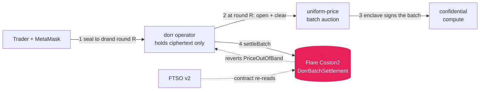

<div align="center">

# dorr

**Perpetual futures you can't front-run.**
Private order flow on **Flare** — your order is a commitment the operator itself can't read, and the batch that settles it is checked against **FTSO v2** on-chain before the chain will accept it.

`FLR · XRP · BTC · ETH · SOL · DOGE` · up to 20× · **FXRP**-margined · settled on Flare Coston2

</div>

---

## Submission — Flare Summer Signal

**Bounty:** **Confidential Compute Apps** (primary) · **Interoperable Asset Products** (secondary — FXRP is the margin asset and the vault's only collateral).

**Target user:** leveraged perp traders whose order flow is large enough to be worth front-running — the people currently paying a timing tax on every fill — plus the market makers quoting against them, who price that toxicity into spreads.

**What was built during the program.** dorr existed before this hackathon as a privacy-perps prototype on a different stack. Everything that makes it a Flare product was built here:

| Built for Flare | What it replaced |
|---|---|
| `DorrVault`, `DorrBatchSettlement`, `TEEAttestationVerifier` (Solidity, deployed on Coston2) | no on-chain settlement layer |
| FTSO v2 as the price source, resolved via `ContractRegistry`, and **re-read on-chain by the settlement contract** | an off-chain HTTP price feed |
| FXRP (FAssets) as real margin, custodied non-custodially | a self-minted test token |
| Confidential matching enclave — ECIES-sealed orders, signed batch attestations verified on-chain | operator read every order in the clear |
| EIP-191 wallet auth, EVM wallet connection, chart history reconstructed from FTSO at past block heights | a non-EVM wallet stack |

The prior work is the perps engine itself — vAMM, margin, funding, liquidation — and the drand timelock sealing. What is new is that the confidentiality is now *enforceable*: an enclave the operator cannot read through, and a contract that refuses a batch priced away from FTSO.

**Roadmap.**
1. **Prove the clearing, don't assert it** — a fixed-N ZK circuit over the uniform-price computation, so the epoch's fills are verifiable rather than trusted.
2. **Move liquidation on-chain** — today the keeper is off-chain; the maintenance-margin check belongs in `DorrVault`.
3. **Run the enclave in Flare Confidential Compute** — the attestation format and on-chain verifier are already in place; today the enclave is a separate process holding its own key, and the measurement it registers is not yet hardware-rooted.
4. **Decentralise the batch operator** — the sealed path already means an operator cannot front-run; the remaining risk is liveness and censorship, which wants more than one sequencer.

**Demo:** see [VIDEO.md](./VIDEO.md) for the walkthrough script, [DEMO.md](./DEMO.md) for the live version. Working app: `bun run --cwd apps/web dev` after the Quickstart below.

---

## The problem

On every public perp DEX your order sits in the mempool before it executes. Searchers read it, trade ahead of it, and sandwich you. On a leveraged product that timing tax is brutal — and it's structural, not a bug.

Sealing the order from the *public* isn't enough either: the venue that matches it can still read it, and nothing stops a venue from settling your batch at a price it made up.

## What dorr does

Your browser **timelock-encrypts** the order to a future drand round, so the operator receives ciphertext it provably cannot open until the batch is already frozen. The epoch then clears at **one uniform price**, and the result is submitted to `DorrBatchSettlement` on Flare — a contract that **independently re-reads the FTSO v2 feed** and reverts if the clearing price is out of band, and that verifies a TEE attestation bound to that exact batch.



**The A/B proof:** flip one toggle. In *public* mode the order leaks and a bot sandwiches you (~150 bps stolen). In *dorr* mode the same order is a hash — the bot is blind, you fill fair.

**Operator-blind, not just public-blind.** The client seals to a drand round (the League of Entropy — a live 12-of-22 threshold network), so the operator holds only ciphertext and **cannot decrypt until the batch is frozen**. *Verified live: the operator's decrypt is refused (`"too early — decryptable at round N"`).*

**Front-running made *impossible*, not just invisible.** Every order in an epoch settles at one price, so a bot that inserts a front-run + back-run buys and sells at the *same* price — the sandwich nets **$0 by construction** (live: `$0.00` vs `$152` on a sequential venue).

**The chain is the referee.** `DorrBatchSettlement.settleBatch` re-reads FTSO itself and reverts `PriceOutOfBand` beyond `maxDriftBps` — observed rejecting a real batch in testing. `DorrVault` pays out only to the depositor, and settlement can only move PnL that sums to zero. Plus private limit orders, hidden stop-loss/take-profit, selective disclosure, and a live solvency attestation. Details in [FEATURES.md](./docs/FEATURES.md).

## Proven live on Coston2

Driven from the browser with a real wallet — every leg is a real transaction:

| leg | tx |
|---|---|
| FXRP approve + **vault deposit** | [`0x1d716fc5…`](https://coston2-explorer.flare.network/tx/0x1d716fc540915da12051700e4a74b74160804b8bf45d60ab2f0b99149b910b71) |
| **sealed batch settled on Flare** (FTSO re-read + enclave quote verified) | [`0x3a732edf…`](https://coston2-explorer.flare.network/tx/0x3a732edf643605afbbfaa0c98bd1bc6214ab894759415e7c5a5b76e2209e3312) |
| earlier sealed batch | [`0xd942461e…`](https://coston2-explorer.flare.network/tx/0xd942461ed322c2a83f974c98ef16e863d6a014aeb49e4ff8db24e466cc995619) |
| **depositor-signed withdrawal** (operator uninvolved) | [`0x32d2aad1…`](https://coston2-explorer.flare.network/tx/0x32d2aad1f82f3b1ea3791a397f40cdd78de04aefbdab88351c134473baa98bd2) |

Deployed contracts:

| contract | address |
|---|---|
| `DorrVault` (FXRP margin) | [`0x65b705A4…`](https://coston2-explorer.flare.network/address/0x65b705A49778b9d7bD741A0A979162393c699a98) |
| `DorrBatchSettlement` | [`0x047478DE…`](https://coston2-explorer.flare.network/address/0x047478DE7d2ed6B41dEFC14223764411288Db845) |
| `TEEAttestationVerifier` | [`0x578D75dD…`](https://coston2-explorer.flare.network/address/0x578D75dDbce7fBB05072b733F372De2241d698aE) |

## Quickstart

```bash
bun install
bun run --cwd services/operator start   # :8791
bun run --cwd apps/web dev              # :3000
```

Connect MetaMask on **Flare Coston2** (chain `114`) → claim test FXRP from [Flare's faucet](https://faucet.flare.network/coston2) → deposit from the Collateral panel → trade. The chart is drawn from the operator's own FTSO v2 samples, so its history grows as the operator runs (and persists across restarts) — there is no third-party price API in the loop. dorr holds no minting authority over FXRP; collateral is a real asset the vault custodies non-custodially.

## Architecture

| Path | What |
|---|---|
| `apps/web` | Next.js trading terminal → EIP-1193 wallet (Coston2), browser-side drand sealing, operator API |
| `services/operator` | 6 markets on **FTSO v2**, vAMM executor, margin/funding/liquidation, sealed-bid batch keeper, Flare tx layer |
| `services/operator/src/enclave` | confidential matching engine — holds the ECIES key, signs batch attestations |
| `contracts` | `DorrVault` · `DorrBatchSettlement` · `TEEAttestationVerifier` (Solidity/Foundry) |
| `packages/engine` | the order-commitment scheme (`SHA-256(fields‖nonce)`) — the primitive privacy and selective disclosure rest on |

## Docs

Full docs in [`docs/`](./docs) → [architecture](./docs/ARCHITECTURE.md) · [features](./docs/FEATURES.md) · [wallets & setup](./docs/WALLETS.md) · [API & contracts](./docs/API.md) · [security & honest scope](./docs/SECURITY.md) · [testing](./docs/TESTING.md).
Also: design rationale in [DESIGN.md](./DESIGN.md) · stage script in [DEMO.md](./DEMO.md) · **video script in [VIDEO.md](./VIDEO.md)** · ops in [RUNBOOK.md](./RUNBOOK.md).

## Testing

**88 operator + 31 Solidity + 3 engine tests**, all green. Coverage includes the sealed-bid timelock path against **live drand**, uniform-price batch clearing, selective disclosure (including re-opening a sealed order's ciphertext), EIP-191 auth against real keys, the FTSO drift guard, TEE attestation binding, the liquidation and funding keepers driven through their real scan functions, and two `DorrVault` fuzz runs asserting a withdrawal can never exceed free balance, with or without locked margin. See [docs/TESTING.md](./docs/TESTING.md).

## Honest scope (v1)

dorr's guarantee today: **neither the public nor the operator can see or front-run a sealed order**, the epoch clears at one price, collateral is **self-custodied**, and the settlement contract **rejects an off-market price**.

Margin behind an open position is **locked in the vault**, so a trader cannot withdraw collateral backing their own position — verified live: with 3.6 FXRP deposited and 1.5 locked, `withdraw(3.0)` reverts and `withdraw(2.0)` succeeds.

What is still trusted: the operator for **liveness/censorship** (the on-chain membership root makes censorship detectable, not impossible); the **uniform-price computation** is auditable but not ZK-proven; and **liquidation runs off-chain**. Full detail, including the threat-model table, in [SECURITY.md](./docs/SECURITY.md).

## Tech

Flare (Coston2) · FTSO v2 · FAssets/FXRP · Solidity + Foundry · drand timelock (tlock) · confidential compute (TEE attestation) · viem · Next.js · Bun · TypeScript

<div align="center"><sub>Perps core from UniPerp; anti-front-running approach inspired by Nucast's Anti-Front-Running-ZKPerps research.</sub></div>
