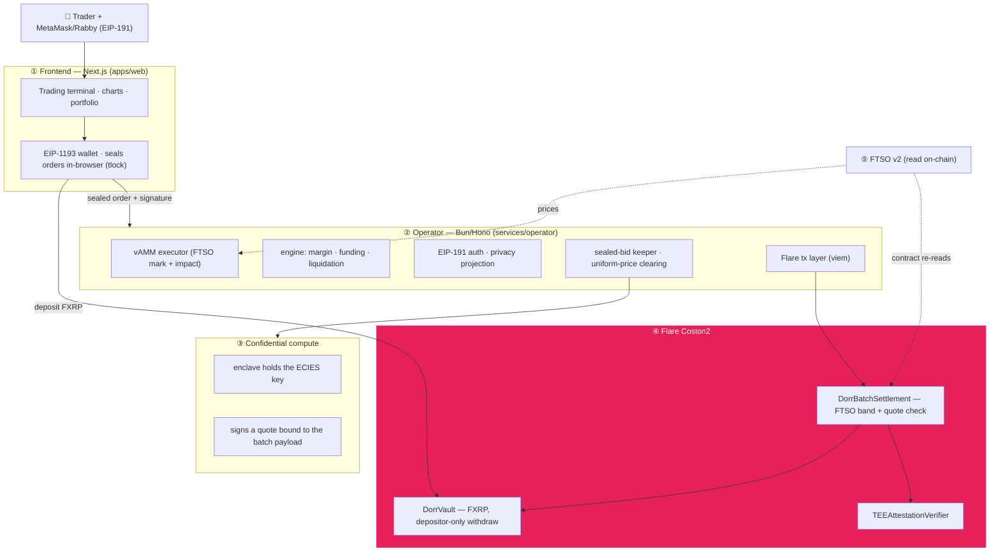
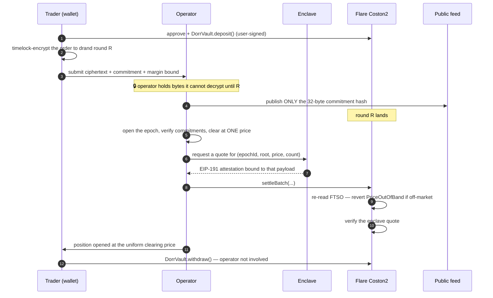
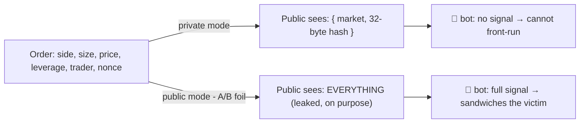
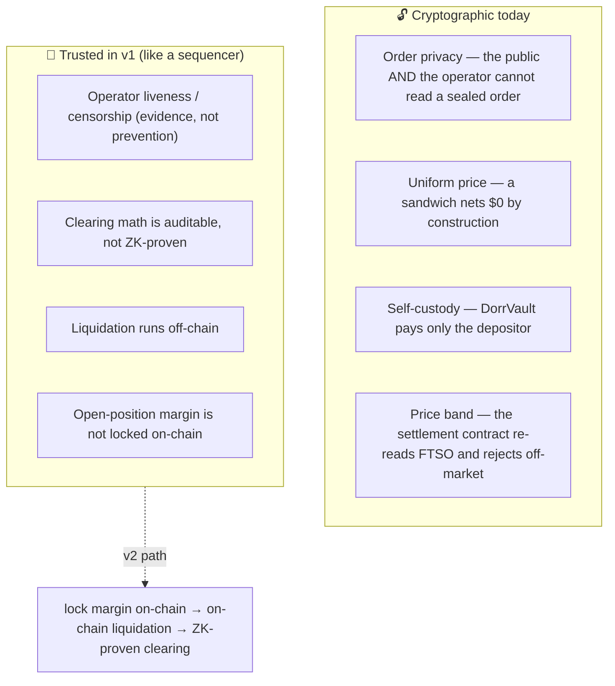

# 🏗️ Architecture

dorr fuses two things that normally don't meet: a **real perps trading app** (UniPerp's UI + engine) and an **anti-front-running execution layer** (drand-timelock sealed orders cleared in uniform-price batches, settled on Flare). The result is a perp whose operator cannot read your order in time to trade ahead of it.

## The five layers



| Layer | Package | Real vs stub |
|-------|---------|--------------|
| Frontend | `apps/web` | UniPerp premium UI on an EIP-1193 wallet; seals orders in-browser with tlock |
| Operator | `services/operator` | vAMM, accounting, EIP-191 auth, sealed-bid keeper, Flare tx layer |
| Enclave | `services/operator/src/enclave` | separate process; holds the ECIES key and signs batch attestations |
| Engine | `packages/engine` | off-chain perps engine (margin/funding/liquidation/commitment/uniform-price clearing) |
| Contracts | `contracts` | `DorrVault` · `DorrBatchSettlement` · `TEEAttestationVerifier` (Solidity, Foundry green) |

## A trade, end to end



Every step above is **real** — driven from a browser against Coston2, with the deposit, batch settlement and withdrawal all on-chain. See the [README](../README.md#proven-live-on-coston2) for the transactions.

## The privacy boundary

The single source of truth for "what the public can see" is one pure function, `publicFeedView` (`services/operator/src/privacy.ts`), pinned by tests:



The commitment is `SHA-256(pairId, side, price, size, leverage, margin, nonce)` — hiding (no field is recoverable) and binding (any change alters the hash). Brute-forcing the 128-bit nonce is infeasible. See [SECURITY](./SECURITY.md).

## The oracle-priced vAMM

Ported from UniPerp's constant-product model: virtual reserves, price impact on fills, and a keeper that re-centers the pool to the FTSO index. One trader can open a leveraged long/short with no counterparty; the A/B demo can run a *real* sandwich on it (then restore the pool).

```
mark = virtualQuote / virtualBase        (constant product: base × quote = k)
fill walks the curve → price impact       LONG buys base (price ↑), SHORT sells (price ↓)
keeper recenters to FTSO when drift > 5bps
```

## Trust model (read this)



We claim **"the public can't see or front-run your order"** — not "trustless perp." That distinction is deliberate and documented; see [SECURITY → honest scope](./SECURITY.md#honest-scope).

## Runtime processes

| Process | Port | Notes |
|---------|------|-------|
| web (Next.js) | 3000 | premium trading terminal |
| operator (Hono) | 8791 | the brain |
| enclave | 8795 | confidential matching — holds the ECIES key |
| Flare Coston2 | remote | public RPC `coston2-api.flare.network` |
